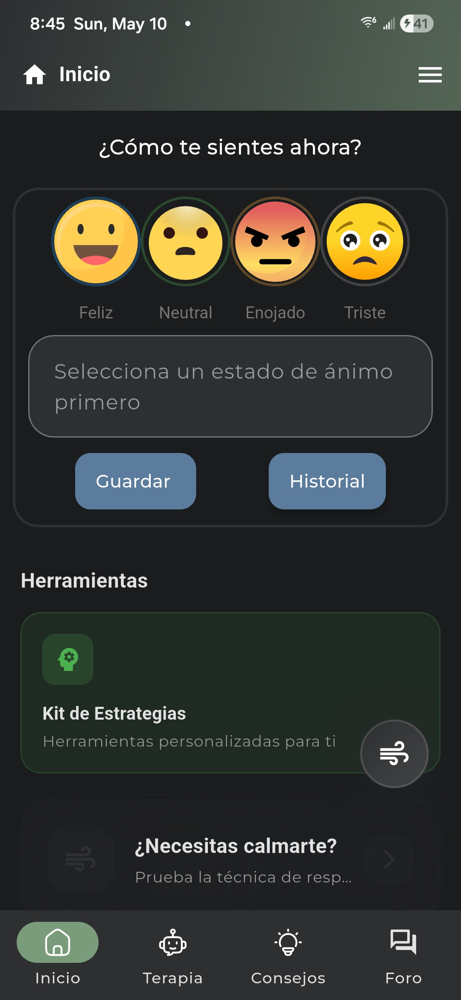
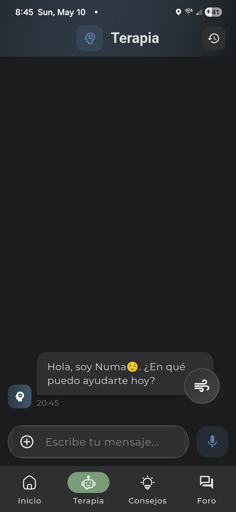
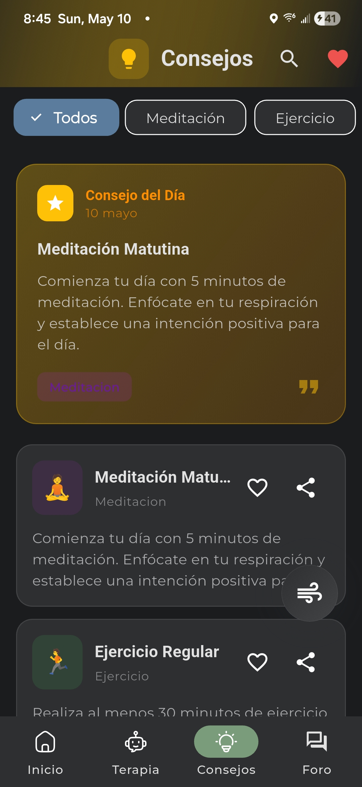
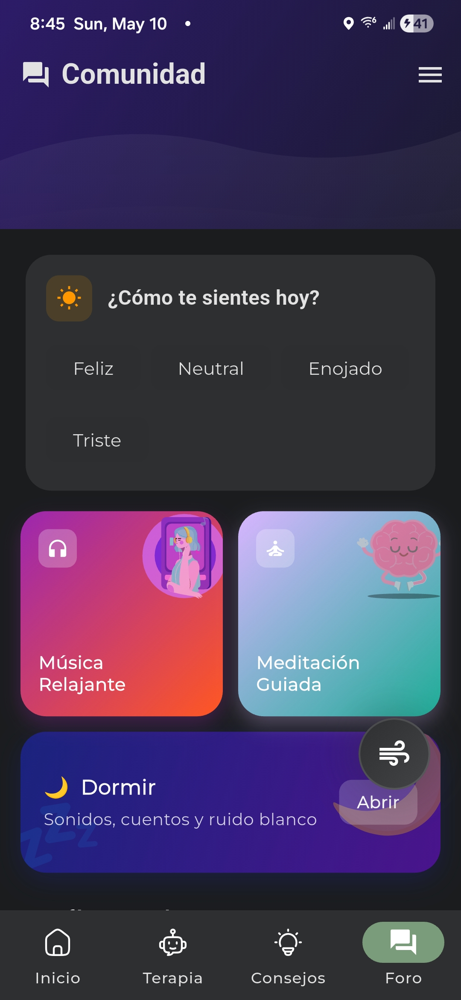
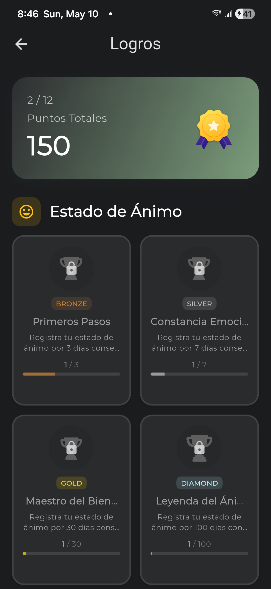
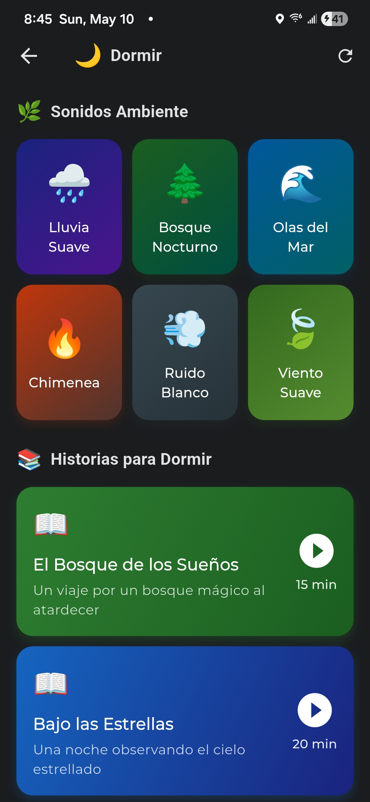
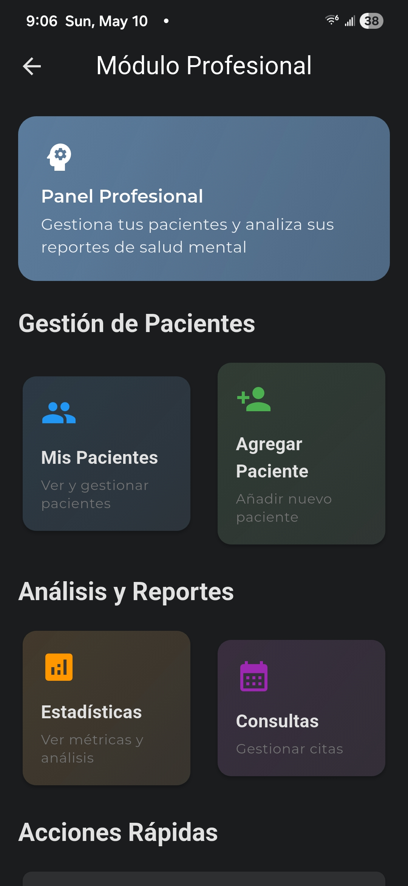
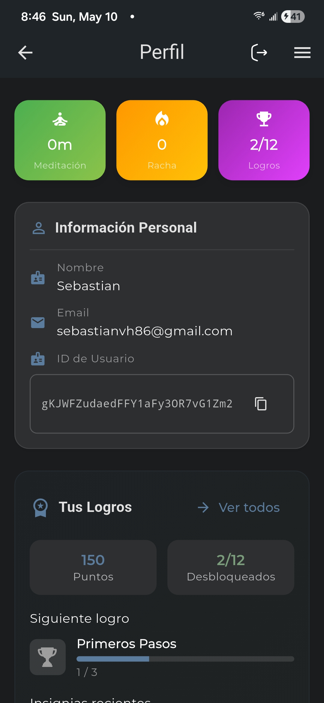
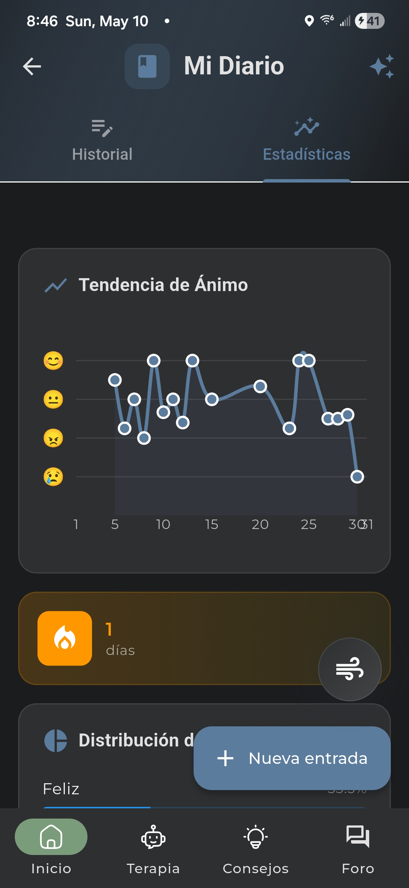

# CalmMind

A modern Flutter app for mental wellness, mood tracking, AI-powered audio content, meditation, and professional mental health care.

## Table of Contents

- [Features](#features)
- [Screenshots](#screenshots)
- [Getting Started](#getting-started)
- [Environment Variables](#environment-variables)
- [Architecture](#architecture)
- [Folder Structure](#folder-structure)
- [Dependencies](#dependencies)
- [Contributing](#contributing)
- [License](#license)

## Features

### Core

- **Onboarding**: Personalized onboarding with mood and wellness questions
- **Mood Tracking**: Log your mood, add notes, and view your emotional history
- **AI Therapy Chat**: Chat with an AI (DeepSeek or Gemini) for mental health support
- **Mental Health Reports**: AI-powered assessments and recommendations
- **Professional Care**: Connect with mental health professionals
- **Patient Management**: For professionals to manage and monitor patients
- **Coping Strategies**: Personalized coping tools and exercises
- **Breathing Exercises**: Guided 4-7-8 breathing technique
- **Achievements**: Unlock badges and track your progress
- **Statistics**: Visualize mood trends with charts
- **Dark/Light Theme**: System and manual theme switching

### Sleep & Relaxation

- **Ambient Sounds**: AI-generated ambient audio (rain, forest, waves, fireplace, white noise, wind)
- **Sleep Stories**: AI-generated Spanish bedtime stories with narration
- **Sleep Timer**: Auto-stop playback after a set duration
- **Audio Caching**: Generated audio saved locally for instant replay

### Meditation

- **Local Meditation Tracks**: Play `.mp3` files from `assets/meditation_audios/` — auto-discovered at runtime
- **Firestore Meditations**: Stream meditation audio from the cloud
- **AI-Generated Meditations**: DeepSeek writes guided meditation scripts, ElevenLabs narrates them
- **Progress Slider**: Seek, position/duration display, skip prev/next

## Screenshots

| Home                      | Chat                      | Tips                      |
| ------------------------- | ------------------------- | ------------------------- |
|  |  |  |

| Community                      | Achievements                      | Sleep                      |
| ------------------------------ | --------------------------------- | -------------------------- |
|  |  |  |

| Professional Module               | Profile                      | Statistics                      |
| --------------------------------- | ---------------------------- | ------------------------------- |
|  |  |  |

## Getting Started

### Prerequisites

- [Flutter SDK](https://flutter.dev/docs/get-started/install) (>=3.7.0)
- Firebase project (for Authentication and Cloud Firestore)
- DeepSeek API key (for AI chat and content generation)
- ElevenLabs API key (for text-to-speech and ambient sounds)

### Installation

1. **Clone the repository:**

   ```bash
   git clone https://github.com/SebastianVi1/calm_mind.git
   cd calm_mind
   ```

2. **Install dependencies:**

   ```bash
   flutter pub get
   ```

3. **Set up Firebase:**
   - Add `google-services.json` (Android) and `GoogleService-Info.plist` (iOS)
   - Verify `lib/firebase_options.dart`

4. **Configure environment variables:**
   Create a `.env` file at the project root:

   ```env
   FIREBASE_API_KEY=your_key
   FIREBASE_PROJECT_ID=your_project
   DEEPSEEK_API_KEY=your_key
   ELEVENLABS_API_KEY=your_key
   GEMINI_API_KEY=your_key
   ```

5. **Add local meditation audio (optional):**
   Drop `.mp3` files into `assets/meditation_audios/` — they're discovered automatically.

6. **Generate splash screen:**

   ```bash
   flutter pub run flutter_native_splash:create
   ```

7. **Run the app:**
   ```bash
   flutter run
   ```

## Environment Variables

| Variable              | Required | Purpose                                       |
| --------------------- | -------- | --------------------------------------------- |
| `FIREBASE_API_KEY`    | Yes      | Firebase authentication & Firestore           |
| `FIREBASE_PROJECT_ID` | Yes      | Firebase project identifier                   |
| `DEEPSEEK_API_KEY`    | Yes      | AI chat, story generation, meditation scripts |
| `ELEVENLABS_API_KEY`  | Yes      | Text-to-speech, ambient sound generation      |
| `GEMINI_API_KEY`      | No       | Alternative AI provider                       |

## Architecture

The app follows the **MVVM** (Model-View-ViewModel) pattern with **Provider** for state management.

### AI Audio Pipeline

```
User selects content (sleep/meditation)
         │
         ▼
  Check local cache by content ID
         │
    ┌────┴────┐
    │         │
  Cached   Not cached
    │         │
    ▼         ▼
  Play    DeepSeek generates Spanish script
  file         │
               ▼
          ElevenLabs generates audio (TTS or Sound FX)
               │
               ▼
          Save MP3 → Cache → Play
```

### Data Flow

- **Services** (`lib/services/`) handle external APIs and business logic
- **ViewModels** (`lib/viewmodels/`) manage UI state and orchestrate services
- **Views** (`lib/ui/view/`) render UI and delegate actions to ViewModels
- **Models** (`lib/models/`) define data structures

## Folder Structure

```
lib/
  main.dart                        # App entry point, providers, JustAudio init
  firebase_options.dart            # Firebase configuration
  models/                          # Data models
    meditation_audio_model.dart    # Meditation tracks (local + Firestore + AI)
    sleep_content_model.dart       # Ambient sounds & sleep stories
    user_model.dart                # User profile
    mood_model.dart                # Mood entries
    achievement_model.dart         # Achievement badges
    coping_strategy_model.dart     # Coping strategies
  services/                        # Business logic & API services
    ai/                            # AI service interface & LLM-specific implementations
      i_ai_service.dart            # Interface (DeepSeek & Gemini)
    deepseek_service.dart          # DeepSeek API (chat + content generation)
    elevenlabs_service.dart        # ElevenLabs TTS & sound effects
    sleep_content_generator.dart   # AI pipeline: generate + cache audio
    relaxing_music_service.dart    # Relaxing music service
    user_service.dart              # User data operations
    haptics_service.dart           # Haptic feedback
  repositories/                    # Data abstraction layer
    meditation_repository.dart     # Firestore meditation data
    chat_messages_repository.dart  # Chat message persistence
  viewmodels/                      # MVVM view models (ChangeNotifiers)
    sleep_view_model.dart          # Sleep content player & timer
    meditation_view_model.dart     # Meditation player & generation
    chat_view_model.dart           # AI therapy chat
    mood_view_model.dart           # Mood tracking
    auth_view_model.dart           # Authentication
    user_view_model.dart           # User profile & stats
    tips_view_model.dart           # Mental health tips
    achievement_view_model.dart    # Achievement tracking
    theme_view_model.dart          # Theme switching
    ...                            # (20 total view models)
  ui/                              # UI layer
    view/                          # Main screens
      home_page.dart               # Home dashboard
      sleep_picker.dart            # Sleep content picker + player
      meditation_picker.dart       # Meditation list
      meditation_screen.dart       # Meditation player
      therapy_page.dart            # AI therapy chat
      emotions_screen.dart         # Mood history & charts
      coping_strategies_screen.dart # Coping strategies
      profile_page.dart            # User profile & settings
      ...                          # (25 total screens)
    widgets/                       # Reusable components
      mood_lottie_container.dart   # Animated mood selector
      breathing_button.dart        # Breathing exercise widget
    themes/                        # Theme configuration
      theme_config.dart            # Light/dark themes, AppBar, buttons
    constants/                     # UI constants
  providers/                       # State providers
```

## Dependencies

Key packages:

- **State**: `provider`
- **Firebase**: `firebase_core`, `firebase_auth`, `cloud_firestore`, `google_sign_in`
- **Audio**: `just_audio`
- **AI**: `http`, `google_generative_ai`
- **UI**: `lottie`, `fl_chart`, `flutter_animate_on_scroll`, `google_fonts`, `hugeicons`
- **Storage**: `shared_preferences`, `path_provider`
- **Utilities**: `flutter_dotenv`, `intl`, `uuid`, `image_picker`, `share_plus`

See [`pubspec.yaml`](pubspec.yaml) for the complete list.

## Contributing

Contributions are welcome! Please open issues and submit pull requests for improvements or bug fixes.

## License

[MIT](LICENSE) © 2025 Andre Sebastian Villarreal Heredia

## Contact

For questions or support, open an issue or contact [sebastianvh86@gmail.com](mailto:sebastianvh86@gmail.com).
