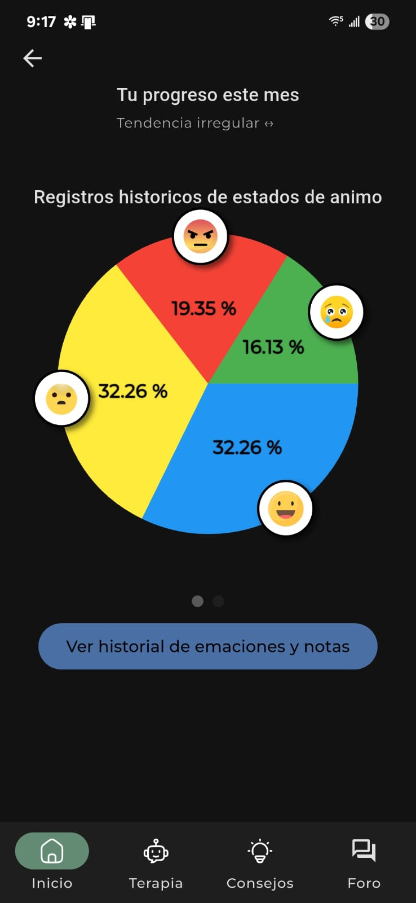

# CalmMind

A modern Flutter app for mental wellness, mood tracking, meditation, and professional mental health care.

## Table of Contents

- [Features](#features)
- [Screenshots](#screenshots)
- [Getting Started](#getting-started)
- [Usage](#usage)
- [Folder Structure](#folder-structure)
- [Dependencies](#dependencies)
- [Contributing](#contributing)
- [License](#license)
- [Contact](#contact)

## Features

- **Onboarding**: Personalized onboarding with mood and wellness questions.
- **Mood Tracking**: Log your mood, add notes, and view your emotional history.
- **AI Therapy Chat**: Chat with an AI for mental health support and guidance.
- **Mental Health Reports**: AI-powered mental health assessments and recommendations.
- **Professional Care**: Connect with mental health professionals for personalized care.
- **Patient Management**: For professionals to manage and monitor their patients.
- **Mental Health Tips**: Browse categorized tips and save your favorites.
- **Meditation & Relaxation**: Listen to guided meditations and relaxing music.
- **Achievements**: Unlock badges and track your progress.
- **Statistics**: Visualize your mood trends and progress with charts.
- **Dark/Light Theme**: Supports system and manual theme switching.

## Professional Features

### For Mental Health Professionals

- Add and manage patients
- View patient mental health reports
- Track patient progress
- Add professional notes
- Update patient status and information

### For Patients

- Complete mental health assessments
- Receive detailed AI-generated reports
- Share reports with professionals
- Track progress over time
- Get personalized recommendations

## Screenshots

<!-- Add your screenshots here -->

| Home                       | Mood Tracking              | AI Therapy Chat               | Achievements                       |
| -------------------------- | -------------------------- | ----------------------------- | ---------------------------------- |
|  |  |  |  |

## Getting Started

### Prerequisites

- [Flutter SDK](https://flutter.dev/docs/get-started/install) (>=3.7.0)
- [Dart SDK](https://dart.dev/get-dart)
- Firebase project (for authentication and Firestore)

### Installation

1. **Clone the repository:**
   ```bash
   git clone https://github.com/SebastianVi1/calm_mind.git
   cd calm_mind
   ```
2. **Install dependencies:**
   ```bash
   flutter pub get
   ```
3. **Set up Firebase:**
   - Add your `google-services.json` (Android) and `GoogleService-Info.plist` (iOS) to the respective folders.
   - Update `lib/firebase_options.dart` if needed.
4. **Configure environment variables:**
   - Copy `.env.example` to `.env` and fill in your keys.
5. **Run the app:**
   ```bash
   flutter run
   ```

## Usage

- Log in or register with your email or Google account.
- Complete the onboarding to personalize your experience.
- Track your mood, chat with the AI, explore tips, and join the community.
- View your achievements and statistics to monitor your progress.
- For professionals, manage patients and view reports.

## Folder Structure

```
lib/
  models/           # Data models
  providers/        # State providers
  repositories/     # Data repositories
  services/         # Business logic and API services
  ui/               # UI components and screens
    view/           # Main app screens
    widgets/        # Reusable widgets
    themes/         # Theme configuration
    constants/      # UI constants
  viewmodels/       # MVVM view models
  firebase_options.dart # Firebase config
  main.dart         # App entry point
```

## Dependencies

Key packages:

- `flutter`, `provider`, `cloud_firestore`, `firebase_auth`, `firebase_core`, `google_sign_in`, `shared_preferences`, `lottie`, `fl_chart`, `just_audio`, `image_picker`, `url_launcher`, and more. See [`pubspec.yaml`](pubspec.yaml) for the full list.

## Contributing

Contributions are welcome! Please open issues and submit pull requests for improvements or bug fixes.

## License

[MIT](LICENSE) © 2025 Andre Sebastian Villarreal Heredia

## Contact

For questions or support, open an issue or contact [sebastianvh86@gmail.com](mailto:sebastianvh86@gmail.com).
